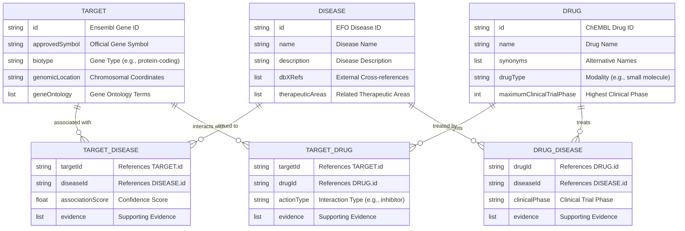

```mermaid
erDiagram
    TARGET {
        string id "Ensembl Gene ID"
        string approvedSymbol "Official Gene Symbol"
        string biotype "Gene Type (e.g., protein-coding)"
        string genomicLocation "Chromosomal Coordinates"
        list geneOntology "Gene Ontology Terms"
    }

    DISEASE {
        string id "EFO Disease ID"
        string name "Disease Name"
        string description "Disease Description"
        list dbXRefs "External Cross-references"
        list therapeuticAreas "Related Therapeutic Areas"
    }

    DRUG {
        string id "ChEMBL Drug ID"
        string name "Drug Name"
        list synonyms "Alternative Names"
        string drugType "Modality (e.g., small molecule)"
        int maximumClinicalTrialPhase "Highest Clinical Phase"
    }

    TARGET_DISEASE {
        string targetId "References TARGET.id"
        string diseaseId "References DISEASE.id"
        float associationScore "Confidence Score"
        list evidence "Supporting Evidence"
    }

    TARGET_DRUG {
        string targetId "References TARGET.id"
        string drugId "References DRUG.id"
        string actionType "Interaction Type (e.g., inhibitor)"
        list evidence "Supporting Evidence"
    }

    DRUG_DISEASE {
        string drugId "References DRUG.id"
        string diseaseId "References DISEASE.id"
        string clinicalPhase "Clinical Trial Phase"
        list evidence "Supporting Evidence"
    }

    TARGET ||--o{ TARGET_DISEASE : "associated with"
    DISEASE ||--o{ TARGET_DISEASE : "linked to"

    TARGET ||--o{ TARGET_DRUG : "interacts with"
    DRUG ||--o{ TARGET_DRUG : "targets"

    DRUG ||--o{ DRUG_DISEASE : "treats"
    DISEASE ||--o{ DRUG_DISEASE : "treated by"
```